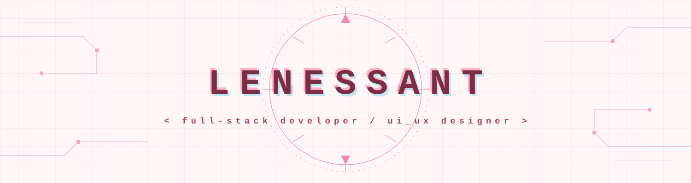

 

  
  

### 🌸 About Me

I'm Lene, a full-stack developer with a strong design eye and a growing interest in AI systems, including Large Language Models (LLMs) and Machine Learning / Deep Learning (ML/DL).

> *(Quick note for fellow learners: LLMs are actually a type of deep learning model, specifically large neural networks trained on huge amounts of text. ML is the broad field, DL is a subset of ML using neural networks, and LLMs are a specialized application of DL. So you're not far off at all.)*

I care about the full picture, not just whether something works, but whether it feels right to use. That's where my UI/UX background comes in. I think in flows, hierarchies, spacing, and emotion, then bring it to life in code.

---

### 🛠️ What I Build

I build **impactful systems**, end-to-end products where the frontend, backend, and underlying logic work together as one coherent experience. Alongside that, I love putting together small, cute side projects just for fun.

That usually looks like:

- 🎨 **Designing the experience first**: wireframes, flows, and UI that prioritize clarity and usability
- 💻 **Building the full stack**: responsive, accessible frontends paired with robust backend architecture and APIs
- 🧠 **Layering in intelligence**: integrating ML/DL models and LLM-powered features when they genuinely add value
- 🔗 **Connecting it all**: making sure data, design, and logic flow smoothly so the final product feels intentional, not bolted together
- 🌷 **Building for fun too**: small, playful side projects that keep the creativity flowing

I'm drawn to projects where good design and good engineering aren't separate steps, they're part of the same thought process.

---

### 🧰 Tech Stack

**Languages & Frameworks**

**AI / ML**

**Design**

**Tools**

---

### 🌷 Let's Connect

  
  
  

